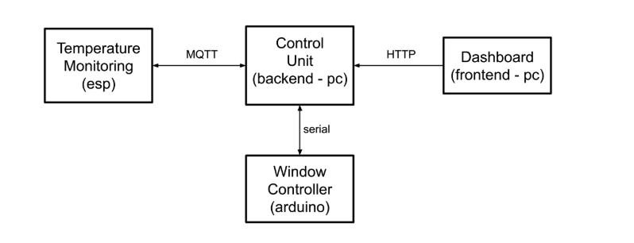

**Embedded Systems and IoT  \- a.y. 2024-2025**

**Assignment \#03 \- *Smart Temperature Monitoring*** 

**v1.0.0-20241211**

We want to realise an IoT system monitoring the temperature of a closed environment, equipped with a window. The system is composed of 4 subsystems: 

- **Temperature Monitoring subsystem (based on ESP)**   
  - embedded system to monitor the temperature of the closed environment  
  - It interacts with the Control Room subsystem (via MQTT)  
- **Control Unit subsystem  (backend \- running on a PC)**   
  - main subsystem, governing and coordinating  the whole system  
  - it interacts via MQTT with the Temperature Monitoring  
  - it interacts through the serial line with the Window Controller   
  - it interacts via HTTP with the Dashboard   
- **Window Controller subsystem (Arduino)**   
  - embedded system controlling the window (opening) and providing a panel for operators interaction in place  
  - it interacts via serial line with the Control Unit backend   
- **Dashboard subsystem (Frontend/web app on the PC)**   
  - front-end for operators to remotely visualise data and interact with the system  
  - it interacts via HTTP with the Control Unit backend

*Hardware components* 

- Temperature Monitoring subsystem  
  - SoC ESP32 board (or ESP8266) including  
    - 1 temperature sensor  
    - 1 green led   
    - 1 red led  
- Window Controller subsystem  
  - Microcontroller Arduino UNO board including:  
    - 1 servo motor  
    - 1 potentiometer  
    - 1 tactile button  
    - 1 LCD display

    

*General Behaviour of the system*

The system is meant to monitor the temperature of the closed environment and \- depending on the value \- control the opening of the window.  It can be in two different modes: AUTOMATIC or MANUAL. In AUTOMATIC mode, the system automatically decides how much the window must be opened, depending on the current temperature. In MANUAL mode, the opening is controlled manually by an operator. The starting mode when booting is AUTOMATIC.

Details:

* About the Temperature Monitoring subsystem  
  * The Temperature Monitoring subsystem is responsible for continuously monitoring the level of the temperature, by means of the temperature sensor.  
    * The temperature value is sampled and sent to the Control Unit subsystem with some  frequency F   
    * This frequency actually depends on the state of the system and is established by the Control Unit subsystem (see later).  
  * When the system is working correctly (network ok, sending data ok)  the green led is on and the red is off; otherwise – in the case of network problems – the red led should be on and the green led off.  
* About the Window Controller subsystem  
  * The Window Controller subsystem is responsible for controlling the motor opening the window – from 0% \= window closed (motor position 0 degree), up to 100% \= full open (motor position 90° degree)  
  * The window opening level depends on the state of the system, established by the Control Unit subsystem (see later)   
  * The Window Controller provides also a button to enable the MANUAL mode, in particular:  
    * When the button is pressed, the controller enters in MANUAL mode, so that the window opening level can be manually controlled by operators using a potentiometer.   
    * To exit from the MANUAL model, the button should be pressed again.    
  * The Window Controller subsystem is equipped also with an LCD display reporting:  
    * the current opening level of the window  
    * current mode (AUTOMATIC or MANUAL)  
    * the current temperature value,  when the modality is MANUAL  
* About the Control Unit subsystem  
  * This subsystem is in charge to keep track of:  
    * the last N temperature measurements  
    * the average / min / max temperature values per period (e.g. daily)  
  * It is also in charge of deciding the opening of the window when the system is in AUTOMATIC mode, depending on the value of the current temperature T. In particular:  
    * When T \< T1, then the system is considered in a "NORMAL state". In this state:  
      * the frequency to be used for monitoring the temperature is  F1  
      * the window should be closed  
    * When T1 \<= T \<= T2, the system is in an "HOT state". In this state:  
      * the frequency to be used for monitoring the temperature must be   F2 \> F1  
      * the window should be opened, of a percentage P proportional to the range \[T1,T2\], so that: when  T \= T1, then P 0.01; when T \= T2, then P \= 1.00;    
    * When T \> T2,  the system is in a "TOO\_HOT state". In this state:  
      * the window should be fully open;  
      * if this condition lasts for at least DT time, then the system goes into an "ALARM state"  
    * In the ALARM state, the system waits for the operator's intervention through the Dashboard.  
* About the Dashboard subsystem  
  * The dashboard has two main functionalities:  
    * To visualise the state of the Temperature Monitoring system. In particular:  
      * A graph of the temperature considering the last N measurements  
      * Current average/max/min value  
      * The state of the system:  NORMAL, HOT, TOO-HOT, ALARM   
      * The window opening level (percentage)  
    * To enter in MANUAL mode and control the opening of the window, through some specific GUI controller  
    * To manage the ALARM state (pressing a button to notify that the problem has been solved, bringing back the system into a NORMAL state) 

*The assignment*

Design and develop a prototype of the Temperature Monitoring system, considering as further  requirements:

- **Temperature  Monitoring subsystem**   
  - Run on ESP32 or ESP8266 (or an equivalent SoC board  
  - The control logic must be designed and implemented using finite state machines (synchronous or asynchronous) and (possibly, if useful) task-based architectures  
  - Must use MQTT to communicate with the Control Unit subsystem  
- **Window Controller subsystem**  
  - Run on Arduino (or an equivalent MCU board)  
  - The control logic must be designed and implemented using finite state machines (synchronous or asynchronous) and  (possibly, if useful) task-based architectures  
  - Communicate with the Control Unit subsystem via serial line  
- **Control Unit subsystem**   
  - Runs on a PC  
    - No specific constraints about the programming/sw technology to be used  
  - Uses:  
    - MQTT to communicate with the Temperature Monitoring subsystem,   
    - HTTP to communicate  with the dashboard, and   
    - via serial line with the Window Controller  
- **Dashboard subsystem**  
  - Run on a PC  
    - No specific constraints about the programming/sw technology to be used  
  - Use HTTP to interact with the Control Unit backend

**The Deliverable**

The deliverable consists in a zipped folder **assignment-03.zip** including:

*  4 subfolders (one for each subsystem)   
- temperature-monitoring-subsystem   
- control-unit-backend  
- window-controller  
- dashboard-frontend  
    
* **doc** folder  
  * including a brief report **(report.pdf)** describing the system, including also a description of FSMs, a representation of the schema/breadboard and the link to a short video demonstrating the system.

